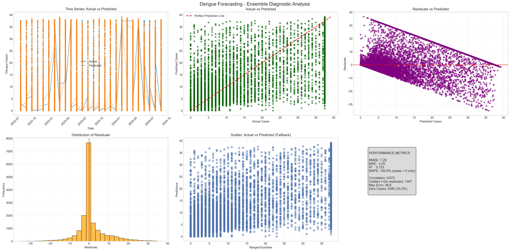

# 🦟 Dengue Cases Forecasting: A Robust Time-Series Approach

This project focuses on building a complete, scientifically robust end-to-end data science pipeline to forecast dengue cases using historical epidemiological and climate data.

The project's foundation is the publicly available dataset sourced from the final thesis (TCC) of a group of students in São Paulo, Brazil. The analysis was refactored to prioritize data integrity and real-world predictive validity.

> 📊 This project was developed as a personal initiative to put into practice the knowledge acquired in the **IBM Professional Data Scientist Certificate** program, with a focus on advanced time-series methodologies.

---

## 📁 Dataset & Original Project Context

- **Source:** [Harvard Dataverse](https://dataverse.harvard.edu/dataset.xhtml?persistentId=doi:10.7910/DVN/NN7EOY)
- **Original Project News Coverage (TCC):** [Students from São Paulo create algorithm to predict dengue cases](https://www.metropoles.com/sao-paulo/estudantes-de-sp-criam-algoritmo-capaz-de-prever-casos-de-dengue)

The dataset contains time-series data on:
- Monthly reported dengue cases (`qntd_casos`)
- Climate variables (temperature, precipitation, wind speed)

---

## 📌 Project Structure
```
aedes_analysis_project/
│
├── data/ # Raw and processed datasets
├── notebooks/ # Jupyter Notebook ([main pipeline](./notebooks/aedes_analysis.ipynb))
├── models/ # Saved plots and model outputs
├── scripts/ # Scripts for cleaning and preprocessing
├── README.md # Project overview
└── requirements.txt # Python dependencies
```

---

---

## 🔍 Methodology: Focus on Integrity

My approach followed a robust time-series machine learning workflow, emphasizing scientific rigor:

### 1. Data Cleaning & **Leakage Prevention**
- **CRITICAL:** Explicitly identified and removed **9 features** related to symptoms and test results (e.g., `qntd_febre`, `qntd_resultado_ns1`) to eliminate data leakage and ensure the model only uses truly predictive, historically available information.
- **Robust Imputation:** Implemented time-aware imputation (seasonal median/FFILL/BFILL) to handle missing climate values without introducing future bias.

### 2. Exploratory Data Analysis (EDA)
- Confirmed strong seasonal trends and the non-contemporaneous relationship between climate and case incidence.

### 3. Feature Engineering
- Created essential **Lag Features** (1 to 12 months) for cases, precipitation, temperature, and wind speed, capturing the biological delay of the *Aedes aegypti* mosquito cycle.
- Engineered monthly and cyclical temporal features (sin/cos encoding).

### 4. Machine Learning & Temporal Validation
- **Validation Strategy:** Used a strict **TimeSeriesSplit** validation, where the model is trained *only* on past data and evaluated *only* on future data, simulating a real-world forecast scenario.
- **Model:** Employed an **Optimized Ensemble Regressor** (combining XGBoost, Random Forest, and GBM) to maximize prediction stability and accuracy.

---

## 🛠️ Technologies Used

This project leverages the following tools and libraries:

- 
- 
- 
- 
- 
- 
- 

---

## 📈 Final Results (Optimized Ensemble Model)

By eliminating data leakage and focusing on lagged, predictive features, the Ensemble Model achieved significantly improved and robust performance on the final test set (20% of the latest data).

| Metric | Optimized Ensemble Regressor | Interpretation |
|---|---|---|
| **R² Score** | **0.753** | The model explains **75.3%** of the variance in dengue cases, a strong result for a time-series forecast. |
| **RMSE** | 7.29 | Average magnitude of error in case counts. |
| **MAE** | 4.20 | Average absolute error in case counts. |
| **Outbreak F1-Score** | **0.808** | Confirms high accuracy in detecting critical outbreak periods. |

**Diagnostic Analysis:**
The diagnostic plots confirm the model's validity, showing that residuals are randomly distributed (no systematic error) and predictions closely track the actual series.

<div align="center">
  
</div>

---

## 💻 Requirements

Install dependencies with:

```bash
pip install -r requirements.txt
```

---

## 📬 Contact
Author: Lucas Galvano de Paula

Email: lucasgalvano.lgp@gmail.com